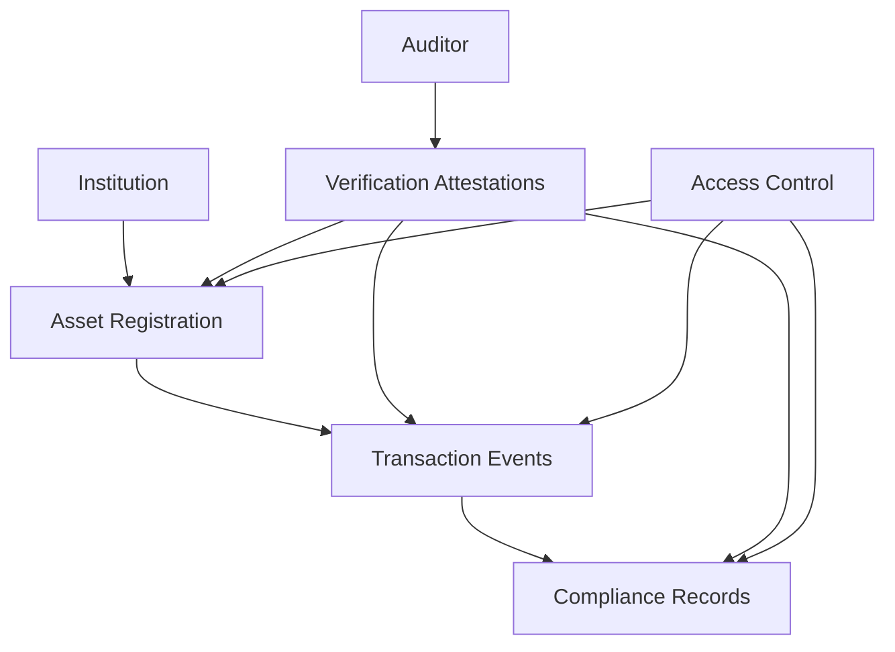

# Control TradFi - Decentralized Financial Compliance Platform

A blockchain-powered solution for transparent, secure, and verifiable financial record-keeping across traditional finance domains. Control TradFi enables financial institutions, auditors, and regulators to track, verify, and manage complex financial assets and transactions on the Stacks blockchain.

## Overview

Control TradFi provides a comprehensive system for:
- Financial asset registration and tracking
- Transaction event logging
- Third-party verification and compliance checks
- Granular access control for sensitive financial data
- Regulatory transparency and auditability

The system serves multiple stakeholders:
- Financial institutions can document transaction details
- Auditors can verify compliance and accuracy
- Regulators can track financial activities
- Investors can validate transaction histories

## Architecture

The system is built on a single smart contract that manages interconnected data structures for financial control.



Core components:
- Financial institution registry
- Asset management
- Transaction tracking
- Compliance records
- Verification system
- Sophisticated access control layer

## Contract Documentation

### Data Structures

1. **Institution Registry**
    - Stores financial institution details
    - Tracks registration status and compliance type

2. **Asset Management**
    - Records financial asset characteristics
    - Tracks ownership, valuation, and transaction history

3. **Transaction Logs**
    - Documents financial transactions
    - Provides comprehensive transaction details

4. **Compliance Records**
    - Stores regulatory compliance verification
    - Tracks audit trails and verification status

5. **Verifier Management**
    - Maintains authorized auditor and regulator information
    - Specifies verification capabilities

### Key Functions

#### Institutional Operations
```clarity
(define-public (register-institution (name (string-ascii 100)) (compliance-type (string-ascii 100))))
(define-public (register-asset (asset-type (string-ascii 255)) (valuation uint) (additional-details (string-ascii 500))))
(define-public (log-transaction (asset-id uint) (transaction-amount uint) ...))
```

#### Verification Operations
```clarity
(define-public (register-verifier (name (string-ascii 100)) (verification-scope (string-ascii 100))))
(define-public (submit-compliance-verification (target-type (string-ascii 20)) (target-id uint) ...))
```

#### Access Control
```clarity
(define-public (grant-data-access (data-type (string-ascii 20)) (data-id uint) ...))
(define-public (revoke-data-access (data-type (string-ascii 20)) (data-id uint) ...))
```

## Getting Started

### Prerequisites
- Clarinet installed
- Stacks wallet for deployment
- Understanding of Clarity and blockchain compliance requirements

### Installation
1. Clone the repository
2. Install dependencies with Clarinet
3. Deploy contract to testnet or mainnet

### Basic Usage

1. Register a financial institution:
```clarity
(contract-call? .tradfi-control register-institution "Global Bank" "International Compliance")
```

2. Register a financial asset:
```clarity
(contract-call? .tradfi-control register-asset "Corporate Bond" u1000000 "High-yield investment")
```

3. Log a transaction:
```clarity
(contract-call? .tradfi-control log-transaction u1 u500000 "Quarterly bond interest payment")
```

## Security Considerations

1. Access Control
    - Strict authorization for all financial operations
    - Granular data access management
    - Multi-level verification requirements

2. Data Validation
    - Comprehensive input validation
    - Robust error handling
    - Immutable transaction and compliance records

3. Verification System
    - Only registered auditors can submit verifications
    - Permanent, tamper-evident compliance history
    - Multiple verification scopes supported

## Development

### Testing
1. Run test suite:
```bash
clarinet test
```

2. Deploy to testnet:
```bash
clarinet deploy --testnet
```

### Best Practices
- Implement multi-signature authorization
- Maintain strict data privacy
- Follow financial regulations and compliance standards
- Use cryptographic proofs for verification
- Implement comprehensive logging for all critical operations